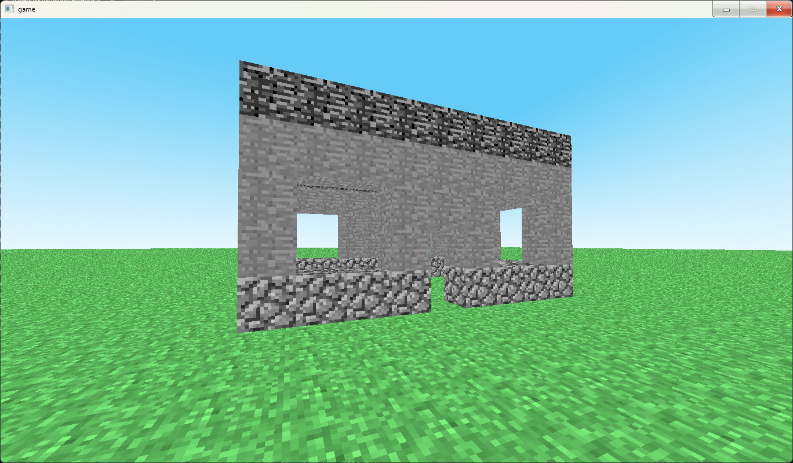

Проект для практики opengl + попытка постепенно создать свой клон Minecraft.

Есть несколько вещей которые я планирую переделать:
1. Mesh builder не такой эффективный как хотелось бы
2. Коллизии однозначно буду улучшать.
3. Обработка кликов мыши.

Сборка:
Через Visual Studio
или
В Developer Powershell запустить non_vs_build.cmd

Зависимости должны установится автоматически
